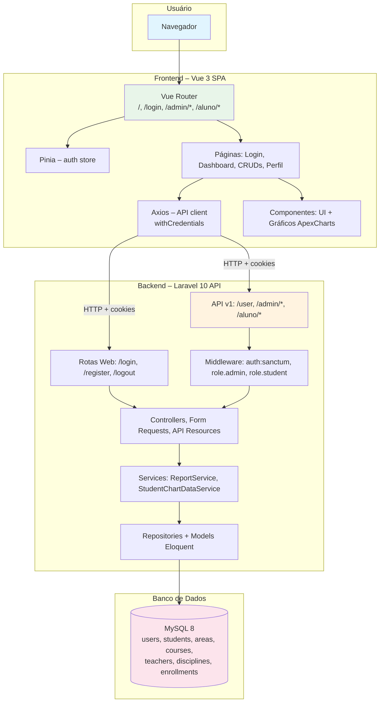
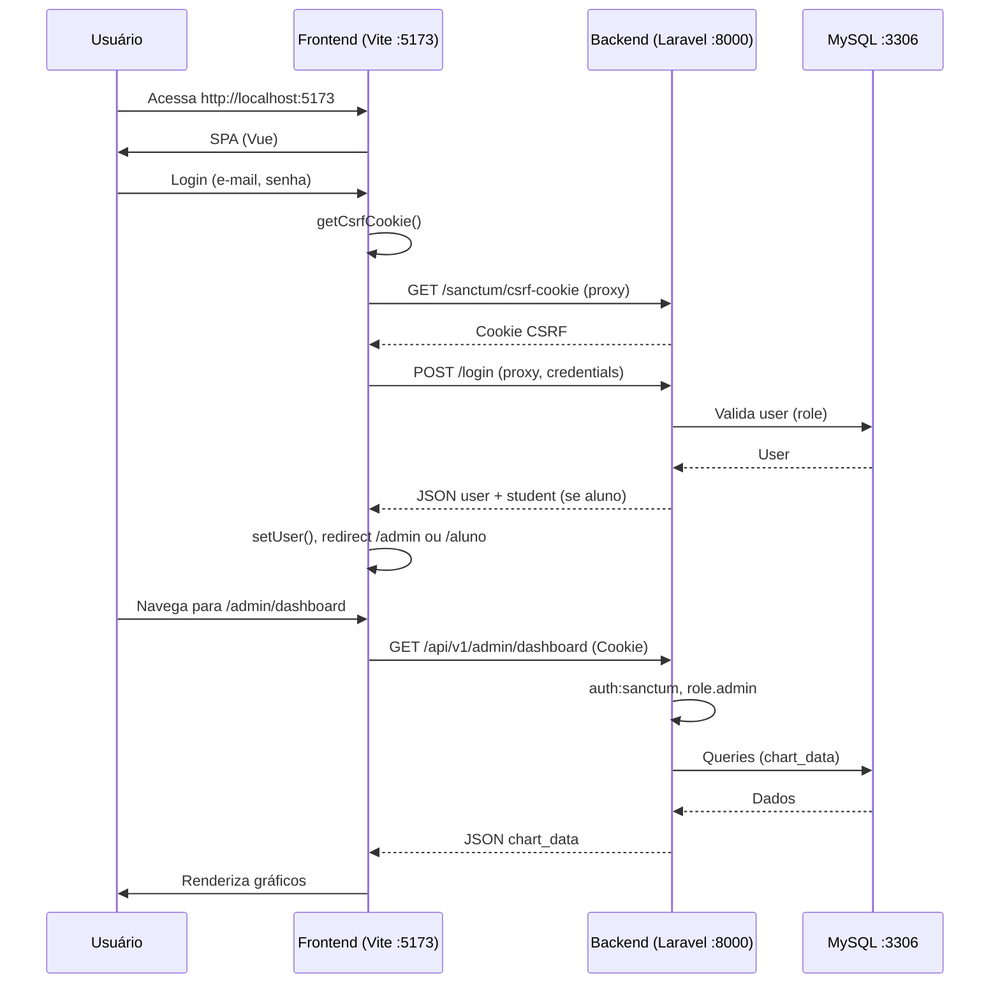

# **Plataforma Prof. Jubilut – Projeto Completo**

Bem-vindo ao repositório da **Plataforma Prof. Jubilut**: uma aplicação completa de gestão escolar com **área administrativa** e **área do aluno**. O projeto é dividido em **Backend** (API Laravel 10 + MySQL), **Frontend** (SPA Vue 3) e **Banco de Dados (MySQL 8)**, que se integram via API REST com autenticação por sessão (Laravel Sanctum). Este README descreve o sistema como um todo, explicando em detalhe o backend, o frontend e o banco de dados, além de como rodar com **Docker** ou em **ambiente local**.

## 📋 Índice

- [Visão Geral do Projeto](#-visão-geral-do-projeto)
- [Arquitetura do Sistema](#-arquitetura-do-sistema)
- [Backend (API Laravel)](#-backend-api-laravel)
- [Frontend (SPA Vue 3)](#-frontend-spa-vue-3)
- [Banco de Dados (MySQL)](#-banco-de-dados-mysql)
- [Fluxo Completo: Do Usuário ao Banco](#-fluxo-completo-do-usuário-ao-banco)
- [Pré-requisitos](#-pré-requisitos)
- [Quick Start (Docker + Frontend)](#-quick-start-docker--frontend)
- [Configuração e Execução](#-configuração-e-execução)
- [Variáveis de Ambiente](#-variáveis-de-ambiente)
- [Credenciais Padrão](#-credenciais-padrão)
- [Estrutura do Repositório](#-estrutura-do-repositório)
- [Documentação Detalhada](#-documentação-detalhada)
- [Solução de Problemas](#-solução-de-problemas)

---

## 🚀 Visão Geral do Projeto

A **Plataforma Prof. Jubilut** é uma solução de gestão escolar que combina:

1. **Backend (Laravel 10)** – API REST em PHP que centraliza a lógica de negócio: usuários (admin e aluno), áreas, cursos, professores, disciplinas, alunos e matrículas. Oferece autenticação via **Laravel Sanctum** (sessão/cookies), proteção de rotas por papel (`admin` e `student`), relatórios (idade média por curso, aluno mais novo/mais velho) e dados para gráficos nos dashboards. Toda a persistência é em **MySQL**, com tabelas criadas **exclusivamente por migrations**.

2. **Frontend (Vue 3 SPA)** – Interface única em Vue 3 + Vue Router + Pinia + Tailwind + ApexCharts. Duas áreas: **Admin** (dashboard com gráficos, CRUD de todas as entidades, relatórios, cadastro de administrador) e **Aluno** (dashboard com “meus cursos”, “minha idade”, “minhas matrículas”, e edição do próprio perfil). Consome a API do backend; em desenvolvimento o **Vite** faz proxy das requisições para o Laravel. Responsiva (PC e mobile).

3. **Banco de Dados (MySQL 8)** – Armazena usuários, alunos, áreas, cursos, professores, disciplinas e matrículas. Todas as tabelas e relacionamentos são definidos por **migrations** do Laravel; o **seed** de desenvolvimento cria dados de exemplo (admin, aluno, áreas, cursos, professores, disciplinas e matrículas).

### O que o sistema oferece

- **Login único** com redirecionamento por papel (admin → `/admin/dashboard`, aluno → `/aluno/dashboard`).
- **Cadastro de aluno** (público em `/register`) e **cadastro de admin** (apenas por admin logado em `/admin/register`).
- **CRUD completo** para Áreas, Cursos, Professores, Disciplinas, Alunos e Matrículas (área admin).
- **Relatórios** com tabela (média de idade por curso, mais novo, mais velho) e dados para gráficos.
- **Dashboards** com vários gráficos (admin: alunos por curso, por faixa etária, por área, matrículas por mês, etc.; aluno: meus cursos, minha idade, minhas matrículas).
- **Filtro** de alunos por nome e e-mail na listagem admin.
- **Responsivo** e preparado para uso em mobile.

### Diferenciais

- **Separação clara:** Backend (API), Frontend (SPA) e Banco (MySQL) documentados e versionados.
- **Autenticação por papel:** Admin e aluno com rotas e dados isolados; Sanctum para sessão/cookies.
- **Banco 100% por migrations:** Nenhuma tabela criada manualmente; integridade referencial via foreign keys.
- **Docker opcional:** Backend e MySQL em containers; frontend pode rodar local com proxy para a API.

---

## 🏗️ Arquitetura do Sistema

O sistema segue uma arquitetura em três camadas: o **usuário** interage apenas com o **Frontend**; o Frontend chama o **Backend** via HTTP (cookies de sessão Sanctum); o Backend persiste e consulta dados no **MySQL**.

### Diagrama da Arquitetura Geral



### Diagrama de Comunicação (Desenvolvimento)



---

## 🔧 Backend (API Laravel)

O **backend** fica na pasta **`backend/`**. É uma API REST em **Laravel 10** que expõe rotas **web** (login, register, logout) e **API v1** (`/api/v1/user`, `/api/v1/admin/*`, `/api/v1/aluno/*`). A autenticação para a API usa **Laravel Sanctum** (sessão/cookies para SPA).

### Responsabilidades do Backend

| Área | Descrição |
|------|-----------|
| **Autenticação** | Login único com validação de `role` (admin/student). Cadastro de aluno (público `POST /register`); cadastro de admin (restrito `POST /api/v1/admin/register`). |
| **Autorização** | Rotas `/api/v1/admin/*` exigem `auth:sanctum` + `role.admin`; `/api/v1/aluno/*` exigem `auth:sanctum` + `role.student`. Middlewares `EnsureUserIsAdmin` e `EnsureUserIsStudent`. |
| **CRUD (Admin)** | Áreas, Cursos, Professores, Disciplinas, Alunos e Matrículas. Validação via Form Requests; respostas em API Resources; ordenação, paginação e filtro de alunos por nome/e-mail. |
| **Relatórios** | **ReportService**: relatório por curso (média de idade, aluno mais novo e mais velho) com Carbon. **StudentChartDataService**: dados para gráficos (admin e aluno); labels de mês em pt_BR. |
| **Perfil do Aluno** | GET/PUT `/api/v1/aluno/profile`; o aluno altera apenas seus próprios dados (nome, e-mail, data de nascimento). |

### Componentes Principais (Backend)

- **Models:** User, Student, Area, Course, Teacher, Discipline, Enrollment. User tem `role` (enum admin/student) e relação 1:1 com Student para alunos.
- **Controllers:** LoginController, RegisterController (web); API v1 Admin (Area, Course, Teacher, Discipline, Student, Enrollment, Dashboard, Report, RegisterAdmin); API v1 Aluno (Dashboard, Profile).
- **Services:** ReportService (courseAgesReport), StudentChartDataService (adminChartData, studentChartData, formatMonthLabel).
- **Repositories:** AreaRepository, CourseRepository, StudentRepository (reuso para relatórios e gráficos).
- **Form Requests / API Resources:** Validação e serialização padronizadas.

### Endpoints da API (resumo)

- **GET** `/api/v1/user` – Usuário logado (com student se aluno). Autenticado.
- **GET** `/api/v1/admin/dashboard` – Dados para gráficos do dashboard admin. Admin.
- **GET** `/api/v1/admin/reports` – Relatório idades por curso + chart_data. Admin.
- **apiResource** `/api/v1/admin/areas`, `courses`, `teachers`, `disciplines`, `students`, `enrollments`. Admin.
- **POST** `/api/v1/admin/register` – Cadastrar novo admin. Admin.
- **GET** `/api/v1/aluno/dashboard` – Dados para gráficos do dashboard aluno. Aluno.
- **GET/PUT** `/api/v1/aluno/profile` – Ver/atualizar perfil. Aluno.

Rotas web: `GET /`, `GET /docs`, `POST /login`, `POST /register`, `POST /logout` (e variantes `/login/admin`, `/login/aluno`).

### Tecnologias do Backend

- PHP ^8.1, Laravel ^10.10, Laravel Sanctum ^3.3, MySQL (PDO), Composer. Extensões: pdo_mysql, mbstring, zip, etc. (ver backend/Dockerfile).

Para **documentação completa** do backend (arquitetura, modelagem, fluxos, testes), consulte **[backend/README.md](backend/README.md)**.

---

## 🖥️ Frontend (SPA Vue 3)

O **frontend** fica na pasta **`frontend/`**. É uma **Single Page Application** em Vue 3 que consome a API do backend. Toda a experiência do usuário (login, cadastro, dashboards, CRUDs, perfil) é entregue por esta SPA.

### Responsabilidades do Frontend

| Área | Descrição |
|------|-----------|
| **Autenticação e Navegação** | Tela única de login; após login, redireciona para `/admin/dashboard` ou `/aluno/dashboard` conforme `user.role`. Router guard (`beforeEach`) garante: não autenticado → `/login`; guest já logado → dashboard do papel; rota de outro papel → redirect. Store Pinia (auth): `user`, `isAdmin`, `isStudent`, `fetchUser`, `logout`, `setUser`. |
| **Dashboard Admin** | Cards de resumo (alunos, matrículas, cursos, etc.) e grid de gráficos (Bar, Donut, Pie, Line, Treemap). Dados de `GET /api/v1/admin/dashboard`. Labels de mês formatados (`formatMonthChartLabels`) para gráficos de linha; layout responsivo. |
| **Relatórios Admin** | Tabela (média de idade por curso, mais novo, mais velho) + gráficos. `GET /api/v1/admin/reports`. |
| **CRUD (Admin)** | Listagens com ordenação e busca (alunos: nome/e-mail). Formulários create/edit para Áreas, Cursos, Professores, Disciplinas, Alunos, Matrículas. Um **Service** por entidade (AreaService, CourseService, etc.). |
| **Área do Aluno** | Dashboard (Meus cursos, Minha idade, Minhas matrículas) e página Editar cadastro (perfil). `GET/PUT /api/v1/aluno/profile`. |
| **Tratamento de Erros** | Axios: 401/403 limpa storage e rejeita; 422 normaliza `error.validationErrors` para formulários. Sem redirect no interceptor (evita loop). |

### Componentes Principais (Frontend)

- **Layouts:** AuthLayout (login/register), AdminLayout (sidebar, menu, ícones lucide-vue-next), AlunoLayout (header, Dashboard / Editar cadastro).
- **Páginas:** auth (Login, Register); admin (Dashboard, Reports, RegisterAdmin, AreaList/Form, CourseList/Form, TeacherList/Form, DisciplineList/Form, StudentList/Form, EnrollmentList/Form); aluno (Dashboard, ProfileEdit).
- **UI:** AppButton, AppInput, AppCard.
- **Gráficos (ApexCharts):** BarChart, PieChart, DonutChart, LineChart, TreemapChart, RadarChart, RadialBarChart. Tema dark e responsivos (LineChart com breakpoints para mobile).
- **Serviços:** AuthService, AdminDashboardService, AreaService, CourseService, TeacherService, DisciplineService, StudentService, EnrollmentService, ReportService, AlunoService.

### Rotas (resumo)

- `/` → redirect para `/login` ou dashboard conforme auth.
- `/login`, `/register` (AuthLayout, guest).
- `/admin/dashboard`, `/admin/areas`, `/admin/courses`, … (AdminLayout, requiresAuth, role admin).
- `/aluno/dashboard`, `/aluno/profile` (AlunoLayout, requiresAuth, role student).

Páginas carregadas sob demanda (`import()`) no router.

### Tecnologias do Frontend

- Vue ^3.4, Vue Router ^4.2 (history), Pinia ^2.1, Axios ^1.6, Vite ^5.0, Tailwind CSS ^3.4, ApexCharts ^4.0 + vue3-apexcharts ^1.4, lucide-vue-next ^0.460.

Para **documentação completa** do frontend (arquitetura, fluxos, estrutura, serviços, componentes), consulte **[frontend/README.md](frontend/README.md)**.

---

## 🗄️ Banco de Dados (MySQL)

O **banco de dados** é **MySQL 8.x** (ou MariaDB compatível). No Docker usa a imagem `mysql:8.0`. Todas as tabelas são criadas pelas **migrations** do Laravel em `backend/database/migrations/`; nenhuma tabela é criada manualmente.

### Modelagem e Tabelas

| Tabela | Descrição | Relacionamentos principais |
|--------|-----------|-----------------------------|
| **users** | Usuários do sistema (login). Campo `role`: `admin` ou `student`. | 1:1 com `students` (quando role = student). |
| **students** | Cadastro de aluno (nome, email, birth_date). Vinculado a um `user`. | user_id → users; N:N com courses via enrollments. |
| **areas** | Áreas de conhecimento (ex.: Biologia, Física). | 1:N com courses. |
| **courses** | Cursos (título, descrição, start_date, end_date, area_id). | area_id → areas; 1:N disciplines; N:N students via enrollments. |
| **teachers** | Professores (nome, email). | 1:N com disciplines. |
| **disciplines** | Disciplinas (título, descrição, course_id, teacher_id). | course_id → courses; teacher_id → teachers. |
| **enrollments** | Matrículas (student_id, course_id). Unique (student_id, course_id). | student_id → students; course_id → courses. |

Além dessas, existem tabelas Laravel: `sessions`, `cache`, `failed_jobs`, `personal_access_tokens` (Sanctum), `password_reset_tokens`.

### Diagrama ER (resumo)

```mermaid
erDiagram
    users ||--o| students : "1:1 (aluno)"
    areas ||--o{ courses : "tem muitos"
    courses ||--o{ disciplines : "tem muitas"
    teachers ||--o{ disciplines : "tem muitas"
    students }o--o{ courses : "matrículas"
    enrollments }o--|| students : "pertence a"
    enrollments }o--|| courses : "pertence a"

    users { bigint id PK, string name, string email UK, string password, enum role, timestamps }
    students { bigint id PK, string name, string email, date birth_date, bigint user_id FK, timestamps }
    areas { bigint id PK, string name, timestamps }
    courses { bigint id PK, string title, text description, date start_date, date end_date, bigint area_id FK, timestamps }
    teachers { bigint id PK, string name, string email, timestamps }
    disciplines { bigint id PK, string title, text description, bigint course_id FK, bigint teacher_id FK, timestamps }
    enrollments { bigint id PK, bigint student_id FK, bigint course_id FK, timestamps }
```

### Migrations e Seed

- **Ordem das migrations:** users → add_role_to_users → areas → teachers → students → courses → disciplines → enrollments (+ tabelas Laravel).
- **Seed (DevelopmentSeeder):** Cria usuário **admin** (`admin@plataforma.test` / `password`), usuário **aluno** com registro em `students` (`emanuel@plataforma.test` / `password`), áreas (Biologia, Física, Química, Matemática), cursos, professores, disciplinas e matrículas de exemplo.

O nome do banco no Docker é **`plataforma`** (`MYSQL_DATABASE` / `DB_DATABASE`). Localmente pode ser o mesmo ou outro; crie o banco e configure `DB_DATABASE` no `.env` do backend.

---

## 🔄 Fluxo Completo: Do Usuário ao Banco

1. **Usuário** acessa http://localhost:5173 (frontend). O Vue Router verifica se há usuário logado (`auth.fetchUser()` → GET /api/v1/user). Se não houver e a rota exigir auth, redireciona para `/login`.
2. **Login:** Frontend chama GET /sanctum/csrf-cookie e POST /login. Backend valida credenciais no MySQL (tabela `users`), verifica `role`, retorna JSON com user (e student se aluno). Frontend chama `setUser(user)` e redireciona para `/admin/dashboard` ou `/aluno/dashboard`.
3. **Dashboard Admin:** Frontend chama GET /api/v1/admin/dashboard (com cookie de sessão). Backend aplica `auth:sanctum` e `role.admin`, chama StudentChartDataService que consulta MySQL (users, students, courses, enrollments, areas, disciplines, teachers) e monta `chart_data`. Resposta JSON é renderizada em gráficos (ApexCharts) no frontend.
4. **CRUD (ex.: listar áreas):** Frontend chama GET /api/v1/admin/areas. Backend valida auth e role, AreaController usa Model Area e API Resource, consulta MySQL (tabela `areas`) e retorna JSON. Frontend exibe tabela.
5. **Persistência:** Qualquer create/update/delete no frontend resulta em POST/PUT/DELETE na API; o backend valida (Form Request), atualiza o MySQL e retorna o recurso (API Resource).

---

## 📌 Pré-requisitos

### Para rodar com Docker (backend + MySQL)

- **Docker Desktop** instalado e em execução.
- **Node.js** (v18+) e **npm** – para rodar o frontend localmente.

### Para rodar tudo local (sem Docker)

- **PHP** 8.1 ou 8.2 (extensões: pdo_mysql, mbstring, openssl, xml, etc.).
- **Composer**.
- **MySQL** 8.x (ou MariaDB compatível).
- **Node.js** (v18+) e **npm**.

---

## ⚡ Quick Start (Docker + Frontend)

1. **Subir backend e MySQL com Docker**

   **Windows (PowerShell):**
   ```powershell
   .\run.ps1
   ```

   **Linux / macOS:**
   ```bash
   chmod +x run.sh
   ./run.sh
   ```

   O script roda `docker compose up -d --build`, aguarda o MySQL e o app (migrate + seed). Backend em **http://127.0.0.1:8000**.

2. **Subir o frontend**
   ```bash
   cd frontend
   npm install
   npm run dev
   ```
   Acesse **http://localhost:5173**. O Vite faz proxy de `/api`, `/login`, `/register`, `/logout` e `/sanctum` para o backend.

3. **Acessar**
   - **Interface:** http://localhost:5173  
   - **Admin:** `admin@plataforma.test` / `password`  
   - **Aluno:** `emanuel@plataforma.test` / `password`  

Para parar: `docker compose down`. Logs: `docker compose logs -f app`.

---

## 🔧 Configuração e Execução

### Backend (local, sem Docker)

```bash
cd backend
composer install
copy .env.example .env   # Windows  |  cp .env.example .env   # Linux/macOS
php artisan key:generate
# Configurar DB_* no .env (DB_HOST, DB_DATABASE, DB_USERNAME, DB_PASSWORD)
php artisan migrate --seed
php artisan serve
```

Backend em **http://127.0.0.1:8000**. Documentação completa: **[backend/README.md](backend/README.md)**.

### Frontend (desenvolvimento)

```bash
cd frontend
npm install
npm run dev
```

Frontend em **http://localhost:5173**. Proxy em `vite.config.js` aponta para `http://127.0.0.1:8000`. Documentação completa: **[frontend/README.md](frontend/README.md)**.

### Build do frontend para produção

```bash
cd frontend
npm run build
```

Saída em **`frontend/dist/`**. Servir por Laravel, Nginx ou outro. Definir **VITE_API_URL** no build se a SPA estiver em outro domínio; configurar CORS e SANCTUM_STATEFUL_DOMAINS no backend.

---

## 🔐 Variáveis de Ambiente

### Backend (`backend/.env`)

O arquivo `backend/.env` é criado a partir de `backend/.env.example`. Abaixo estão todas as variáveis utilizadas pelo backend e um exemplo de conteúdo (sem valores sensíveis).

#### Tabela de variáveis

| Variável | Descrição | Exemplo (local) | Exemplo (Docker) |
|----------|-----------|------------------|------------------|
| **APP_NAME** | Nome da aplicação | Laravel | Plataforma Prof. Jubilut |
| **APP_ENV** | Ambiente (local, production, etc.) | local | local |
| **APP_KEY** | Chave de criptografia (obrigatória) | *(gerar com `php artisan key:generate`)* | *(gerado no entrypoint)* |
| **APP_DEBUG** | Modo debug (true/false) | true | true |
| **APP_URL** | URL do backend | http://127.0.0.1:8000 | http://127.0.0.1:8000 |
| **FRONTEND_URL** | URL do frontend (CORS/Sanctum) | http://localhost:5173 | http://localhost:5173 |
| **SESSION_DOMAIN** | Domínio da sessão (cookies) | localhost | localhost |
| **LOG_CHANNEL** | Canal de log | stack | stack |
| **LOG_DEPRECATIONS_CHANNEL** | Canal para depreciações | null | null |
| **LOG_LEVEL** | Nível de log (debug, info, etc.) | debug | debug |
| **DB_CONNECTION** | Driver do banco | mysql | mysql |
| **DB_HOST** | Host do MySQL | 127.0.0.1 | mysql |
| **DB_PORT** | Porta do MySQL | 3306 | 3306 |
| **DB_DATABASE** | Nome do banco | laravel ou plataforma | plataforma |
| **DB_USERNAME** | Usuário MySQL | root | root |
| **DB_PASSWORD** | Senha MySQL | *(vazio ou sua senha)* | secret |
| **BROADCAST_DRIVER** | Driver de broadcast | log | log |
| **CACHE_DRIVER** | Driver de cache | file | file |
| **FILESYSTEM_DISK** | Disco padrão do filesystem | local | local |
| **QUEUE_CONNECTION** | Conexão da fila | sync | sync |
| **SESSION_DRIVER** | Driver de sessão | file | file |
| **SESSION_LIFETIME** | Tempo de vida da sessão (minutos) | 120 | 120 |

No Docker o backend pode usar **`backend/.env.docker`** como referência (DB_HOST=mysql, DB_PASSWORD=secret).

#### Exemplo de estrutura do `backend/.env` (desenvolvimento local)

```env
APP_NAME=Laravel
APP_ENV=local
APP_KEY=base64:xxxxxxxxxxxxxxxxxxxxxxxxxxxxxxxxxxxxxxxxxxx=
APP_DEBUG=true
APP_URL=http://127.0.0.1:8000
FRONTEND_URL=http://localhost:5173
SESSION_DOMAIN=localhost

LOG_CHANNEL=stack
LOG_DEPRECATIONS_CHANNEL=null
LOG_LEVEL=debug

DB_CONNECTION=mysql
DB_HOST=127.0.0.1
DB_PORT=3306
DB_DATABASE=laravel
DB_USERNAME=root
DB_PASSWORD=

BROADCAST_DRIVER=log
CACHE_DRIVER=file
FILESYSTEM_DISK=local
QUEUE_CONNECTION=sync
SESSION_DRIVER=file
SESSION_LIFETIME=120
```

- **APP_KEY:** Nunca commitar a chave real. Gerar com `php artisan key:generate` após copiar o `.env` do `.env.example`.
- **DB_DATABASE:** Criar o banco no MySQL antes de rodar `php artisan migrate` (ex.: `CREATE DATABASE laravel;` ou `plataforma`).
- **DB_PASSWORD:** Preencher se o MySQL exigir senha no seu ambiente.
- **SESSION_DOMAIN:** Usado para cookies de sessão; `localhost` é comum em desenvolvimento. Para Sanctum com SPA, o domínio do frontend deve estar em `config/sanctum.php` (stateful domains).

### Frontend (`frontend/.env`)

| Variável | Descrição | Desenvolvimento | Produção |
|----------|-----------|------------------|----------|
| VITE_API_URL | URL base da API | Vazio (proxy) | URL completa da API |

Apenas variáveis com prefixo **VITE_** são expostas pelo Vite.

---

## 👤 Credenciais Padrão

Criadas pelo **DevelopmentSeeder** após `php artisan db:seed` (ou ao subir o Docker):

| Papel | E-mail | Senha |
|-------|--------|--------|
| **Administrador** | admin@plataforma.test | password |
| **Aluno** | emanuel@plataforma.test | password |

Use a interface em **http://localhost:5173** para fazer login. Admin → `/admin/dashboard`; aluno → `/aluno/dashboard`.

---

## 📂 Estrutura do Repositório

```
TesteInfityworksPhp/
├── README.md                 # Este arquivo (visão geral, backend, frontend, MySQL, como rodar)
├── docker-compose.yml        # Serviços app (Laravel) + mysql
├── run.ps1                   # Script Windows: sobe Docker e valida
├── run.sh                    # Script Linux/macOS: idem
├── backend/                  # API Laravel 10
│   ├── README.md             # Documentação detalhada do backend
│   ├── .env.example, .env.docker
│   ├── Dockerfile, docker-entrypoint.sh
│   ├── app/                  # Models, Controllers, Services, Repositories, Middleware, etc.
│   ├── config/               # database, auth, sanctum, cors, etc.
│   ├── database/             # migrations, seeders, factories
│   ├── routes/               # web.php, api.php
│   └── tests/
└── frontend/                 # SPA Vue 3
    ├── README.md             # Documentação detalhada do frontend
    ├── index.html, vite.config.js, package.json
    ├── src/
    │   ├── main.js, App.vue, style.css
    │   ├── api/axios.js
    │   ├── stores/auth.js
    │   ├── router/index.js
    │   ├── services/         # AuthService, AdminDashboardService, AreaService, ...
    │   ├── layouts/         # AuthLayout, AdminLayout, AlunoLayout
    │   ├── components/      # ui (AppButton, AppInput, AppCard), charts (Bar, Pie, Line, ...)
    │   └── pages/           # auth, admin, aluno
    └── ...
```

---

## 📚 Documentação Detalhada

- **[backend/README.md](backend/README.md)** – Backend: visão geral, arquitetura, modelagem do banco, autenticação e papéis, fluxo de requisições, componentes (Models, Controllers, Services, Repositories), endpoints, regras de negócio, testes, tecnologias, execução local e Docker.
- **[frontend/README.md](frontend/README.md)** – Frontend: visão geral, arquitetura da SPA, fluxo de autenticação e navegação, estrutura de pastas, API client e interceptors, store Pinia, serviços, layouts e rotas, componentes de UI e gráficos, páginas por área, tecnologias, variáveis de ambiente e build.

---

## 🔧 Solução de Problemas

### Backend não responde após subir o Docker

- Verifique: `docker compose ps` e `docker compose logs -f app`. O entrypoint espera o MySQL; se o MySQL demorar, o app pode ainda estar aguardando.

### Erro de conexão com o banco (local)

- Confirme que o MySQL está rodando e que `DB_HOST`, `DB_DATABASE`, `DB_USERNAME`, `DB_PASSWORD` no `backend/.env` estão corretos. Crie o banco: `CREATE DATABASE plataforma;` se não existir.

### Frontend não consegue fazer login ou retorna 401/404

- Backend deve estar em **http://127.0.0.1:8000** e o proxy em `frontend/vite.config.js` apontando para ele. Para login com sessão, o frontend chama `GET /sanctum/csrf-cookie` e depois POST /login com `withCredentials: true` (já configurado no axios). Em produção, defina **VITE_API_URL** e configure **CORS** e **SANCTUM_STATEFUL_DOMAINS** no backend.

### "Acesso não autorizado" ou redirect para login em /admin ou /aluno

- O guard e o backend verificam o papel. Aluno não acessa rotas de admin e vice-versa. Use a conta correta (admin@plataforma.test ou emanuel@plataforma.test).

### Limpar tudo e recomeçar (Docker)

```bash
docker compose down -v   # Remove containers e volumes (apaga dados do MySQL)
docker compose up -d --build
```

---

**Resumo:** A Plataforma Prof. Jubilut é composta pelo **Backend** (API Laravel 10 + Sanctum + MySQL), pelo **Frontend** (SPA Vue 3 + Pinia + ApexCharts) e pelo **Banco de Dados MySQL** (migrations e seed). Este README descreve a visão geral, a arquitetura, o que cada parte faz e como executar o projeto. Para detalhes de implementação, consulte os READMEs em `backend/` e `frontend/`.
