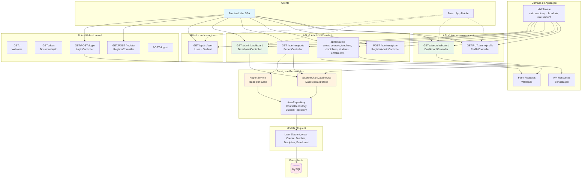
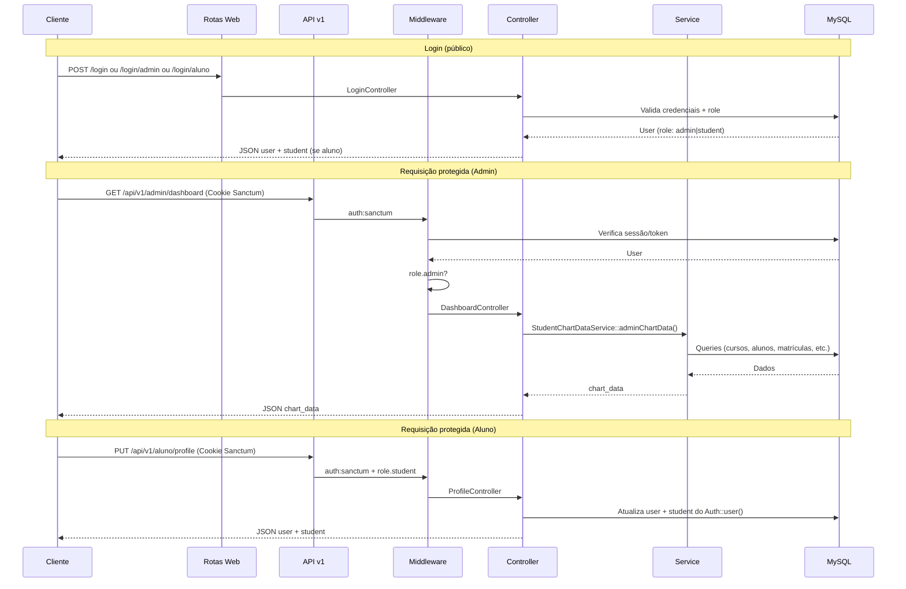
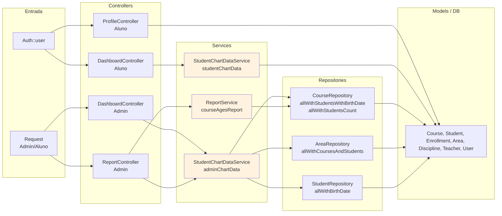
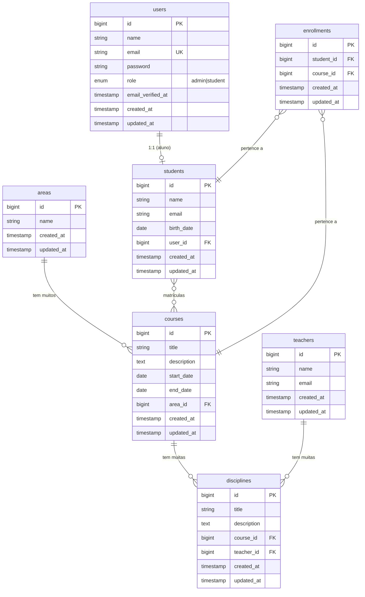

# **Plataforma Prof. Jubilut – Backend (API Laravel)**

Bem-vindo ao **backend** da Plataforma Prof. Jubilut: uma **API REST** em **Laravel 10** que centraliza toda a lógica de negócio da plataforma educacional. O sistema foi projetado para gerenciar áreas de conhecimento, cursos, professores, disciplinas, alunos e matrículas, com **autenticação por papéis** (administrador e aluno), **relatórios por curso** (idade média, aluno mais novo e mais velho) e **dados para gráficos** no dashboard admin e no dashboard do aluno.

O backend é consumido por um **frontend SPA** (Vue.js) e está preparado para futuros clientes (ex.: app mobile). A autenticação é feita com **Laravel Sanctum** (sessão/cookies para SPA e suporte a tokens). Toda a persistência é em **MySQL**, com tabelas criadas **exclusivamente por migrations** e integridade referencial via foreign keys.

## 📋 Índice

- [Visão Geral](#-visão-geral)
- [Arquitetura do Backend](#-arquitetura-do-backend)
- [Modelagem e Banco de Dados](#-modelagem-e-banco-de-dados)
- [Autenticação e Papéis (Admin x Aluno)](#-autenticação-e-papéis-admin-x-aluno)
- [Fluxo de Requisições da API](#-fluxo-de-requisições-da-api)
- [Componentes Principais](#-componentes-principais)
- [Funcionalidades por Área](#-funcionalidades-por-área)
- [Endpoints da API](#-endpoints-da-api)
- [Serviços e Regras de Negócio](#-serviços-e-regras-de-negócio)
- [Testes](#-testes)
- [Tecnologias e Stack](#-tecnologias-e-stack)
- [Execução Local e Docker](#-execução-local-e-docker)

---

## 🚀 Visão Geral

O backend da Plataforma Prof. Jubilut oferece:

1. **🔐 Autenticação e Autorização por Papel:** Login único com validação de `role` (`admin` ou `student`). Rotas `/api/v1/admin/*` exigem **role admin**; rotas `/api/v1/aluno/*` exigem **role student**. Cadastro de aluno é **público** (`POST /register`); cadastro de admin é **restrito** (apenas admin logado via `POST /api/v1/admin/register`).

2. **📊 CRUD Completo (Admin):** Áreas, Cursos, Professores, Disciplinas, Alunos e Matrículas (enrollments), com validação via **Form Requests**, respostas em **API Resources** e suporte a ordenação, paginação e **filtro de alunos** por nome e e-mail (scope `Student::search()`).

3. **📈 Relatórios e Gráficos:** **ReportService** para relatório por curso (média de idade, aluno mais novo e mais velho, usando **Carbon** para cálculo de idade). **StudentChartDataService** para dados de gráficos no dashboard admin (alunos por curso, idade média por curso, alunos por faixa etária, matrículas por curso/mês, alunos por área, disciplinas por curso, etc.) e no dashboard do aluno (meus cursos, minha idade, minhas matrículas).

4. **👤 Área do Aluno:** O aluno acessa apenas **perfil** (GET/PUT `/api/v1/aluno/profile`) e **dashboard** com gráficos; ele altera somente seus próprios dados (nome, e-mail, data de nascimento), garantido pelo middleware e pelo vínculo `user → student`.

5. **🗄️ Banco 100% por Migrations (MySQL):** Todas as tabelas e foreign keys são definidas em migrations; nenhuma tabela é criada manualmente. Modelagem: áreas → cursos → disciplinas (com professores); alunos ↔ cursos via tabela pivot `enrollments`; usuários com `role` e relação 1:1 com `students` para alunos.

6. **🐳 Docker e Ambiente:** Dockerfile (PHP 8.2, Composer, extensões PDO MySQL, etc.) e script de entrada que espera o MySQL, executa `migrate` e `db:seed` antes de subir o servidor. Seed de desenvolvimento (admin, áreas, cursos, professores, disciplinas, alunos e matrículas) para testes e demonstração.

### 🎯 Diferenciais

- **API REST consistente:** Padrão de controllers (index, store, show, update, destroy), Form Requests para validação e API Resources para serialização.
- **Separação de responsabilidades:** Lógica de relatórios e gráficos em **Services** (ReportService, StudentChartDataService); reuso de dados em **Repositories** (AreaRepository, CourseRepository, StudentRepository); controllers finos.
- **CORS e Sanctum configurados** para SPA (frontend Vue em localhost ou domínio configurável).
- **Cobertura de testes:** Testes unitários (Models, Services, Enums, Scopes) e testes de feature (API v1 Admin, Aluno e Auth).

---

## 🏗️ Arquitetura do Backend

O backend é uma aplicação **Laravel monolítica** que expõe **rotas web** (raiz, documentação, login/register/logout) e **rotas API** prefixadas por `api/v1`. A autenticação para a API usa **Laravel Sanctum** (sessão/cookies para SPA e opcionalmente tokens). O frontend consome a API e redireciona para `/admin` ou `/aluno` conforme o `role` retornado no login.

### Diagrama da Arquitetura Geral

### Diagrama do Fluxo de Autenticação e Autorização

### Diagrama da Camada de Dados (Relatórios e Gráficos)

---

## 🗄️ Modelagem e Banco de Dados

Todas as tabelas são criadas por **migrations** em `database/migrations/`, com foreign keys e índices necessários. Ordem lógica de dependência: `users` → `areas` → `teachers` → `students` → `courses` (area_id) → `disciplines` (course_id, teacher_id) → `enrollments` (student_id, course_id). A tabela `users` recebe a coluna `role` em migration específica.

### Diagrama ER

### Resumo das Tabelas

| Tabela         | Descrição                                                                 | Relacionamentos principais                                      |
|----------------|---------------------------------------------------------------------------|------------------------------------------------------------------|
| **users**      | Usuários do sistema (login). Campo `role`: `admin` ou `student`.         | 1:1 com `students` (quando role = student).                      |
| **students**   | Cadastro de aluno (nome, email, birth_date). Vinculado a um `user`.       | user_id → users; N:N com courses via enrollments.                |
| **areas**      | Áreas de conhecimento (ex.: Biologia, Física).                           | 1:N com courses.                                                |
| **courses**    | Cursos (título, descrição, datas, area_id).                               | area_id → areas; 1:N disciplines; N:N students via enrollments.  |
| **teachers**   | Professores (nome, email).                                                | 1:N com disciplines.                                            |
| **disciplines**| Disciplinas (título, descrição, course_id, teacher_id).                   | course_id → courses; teacher_id → teachers.                     |
| **enrollments**| Matrículas (student_id, course_id). Unique (student_id, course_id).       | student_id → students; course_id → courses.                    |

### Migrations (ordem de execução)

- `create_users_table` → `add_role_to_users_table` → `create_areas_table` → `create_teachers_table` → `create_students_table` → `create_courses_table` → `create_disciplines_table` → `create_enrollments_table`
- Inclui ainda: `failed_jobs`, `personal_access_tokens` (Sanctum), `password_reset_tokens`.

---

## 🔐 Autenticação e Papéis (Admin x Aluno)

- **Definição de papel:** O campo `users.role` é do tipo enum (`App\Enums\UserRole`: `ADMIN`, `STUDENT`). Alunos possuem um registro em `students` vinculado ao `user` (user_id). Admins não têm registro em `students`.

- **Cadastro de aluno (público):** `POST /register` — valida nome, email (único em users e students), senha (mín. 8, confirmada), birth_date (obrigatória, anterior a hoje). Cria `User` com `role = student` e um `Student` com os mesmos dados + birth_date, em **transação**. Não faz login automático.

- **Cadastro de admin (restrito):** `POST /api/v1/admin/register` — apenas usuário autenticado com `role = admin` (middleware `role.admin`). Cria `User` com `role = admin`; não cria `Student`.

- **Login:**
  - `POST /login` — aceita qualquer role; após sucesso, o frontend redireciona conforme `user.role`.
  - `POST /login/admin` — só aceita credenciais de usuário com `role = admin`; caso contrário, 403.
  - `POST /login/aluno` — só aceita credenciais de usuário com `role = student`; caso contrário, 403.

  Resposta JSON inclui `user` (UserResource com role e, se aluno, `student`). Para SPA, Sanctum mantém sessão/cookie; o frontend pode chamar `GET /api/v1/user` para obter o usuário atual.

- **Rotas protegidas:**
  - `/api/v1/admin/*` → middleware `auth:sanctum` + `role.admin`.
  - `/api/v1/aluno/*` → middleware `auth:sanctum` + `role.student`.
  - `/api/v1/user` → qualquer usuário autenticado.

---

## 🔄 Fluxo de Requisições da API

1. **Requisição chega** → CORS (HandleCors), Throttle (api), Sanctum (EnsureFrontendRequestsAreStateful para SPA), SubstituteBindings.
2. **Rotas admin:** `auth:sanctum` garante usuário logado; `role.admin` garante `user->role === admin`. Em caso de falha, 401 ou 403.
3. **Rotas aluno:** idem com `role.student`.
4. **Controller** recebe a requisição, usa Form Request (quando aplicável) para validar, chama Model/Repository/Service, devolve API Resource ou JSON.
5. **Services (Report e Chart):** ReportService usa CourseRepository para cursos com alunos e calcula idades com Carbon; StudentChartDataService usa repositórios e models para montar arrays (labels + data) para gráficos no admin e no aluno.

---

## 📦 Componentes Principais

### Models (`app/Models/`)

| Model         | Responsabilidade                                                                 | Relacionamentos / Scopes |
|---------------|-----------------------------------------------------------------------------------|---------------------------|
| **User**      | Autenticação; atributo `role` (UserRole); métodos `isAdmin()`, `isStudent()`.     | HasOne(Student).          |
| **Student**   | Dados do aluno (name, email, birth_date, user_id).                                | BelongsTo(User); BelongsToMany(Course, 'enrollments'); scope `search($term)` e `filter($filters)` por nome/email. |
| **Area**      | Nome da área.                                                                     | HasMany(Course).          |
| **Course**    | Título, descrição, start_date, end_date, area_id.                                 | BelongsTo(Area); HasMany(Discipline); BelongsToMany(Student, 'enrollments'). |
| **Teacher**   | Nome, email.                                                                      | HasMany(Discipline).      |
| **Discipline**| Título, descrição, course_id, teacher_id.                                        | BelongsTo(Course); BelongsTo(Teacher). |
| **Enrollment**| student_id, course_id (pivot com timestamps).                                     | BelongsTo(Student); BelongsTo(Course). |

Models usam **HasFactory**; datas em Course e Student são castadas para `date`. O trait **HasFormattedDates** é usado em Student quando necessário para formatação.

### Controllers

- **Web (`routes/web.php`):**
  - **LoginController:** showLoginForm (redireciona para frontend), login, loginAluno, loginAdmin, logout. Valida credenciais, verifica role quando login é por área (admin/aluno), retorna JSON ou redireciona para o frontend.
  - **RegisterController:** showRegistrationForm (redireciona para frontend), register (cria User + Student com role student).

- **API v1 Admin (`app/Http/Controllers/Api/v1/Admin/`):**
  - **AreaController, CourseController, TeacherController, DisciplineController, StudentController, EnrollmentController:** CRUD em estilo API Resource (index, store, show, update, destroy). StudentController usa `Student::search($request->input('search'))` e ordenação/paginação. EnrollmentController expõe ainda `create` para dados de formulário (alunos e cursos).
  - **DashboardController:** dados do dashboard admin (chart_data via StudentChartDataService).
  - **ReportController:** relatório de idades por curso (ReportService) + chart_data (StudentChartDataService).
  - **RegisterAdminController:** registro de novo admin (apenas admin logado).

- **API v1 Aluno (`app/Http/Controllers/Api/v1/Aluno/`):**
  - **DashboardController:** dados do dashboard do aluno (chart data para “meus cursos”, “minha idade”, “minhas matrículas”).
  - **ProfileController:** edit (retorna user + student), update (atualiza student e user com dados permitidos; apenas o próprio aluno).

### Middleware (`app/Http/Middleware/`)

- **EnsureUserIsAdmin:** Garante `$request->user()` e `$request->user()->role === UserRole::ADMIN`; caso contrário, abort 403.
- **EnsureUserIsStudent:** Garante usuário com `role === UserRole::STUDENT`; caso contrário, abort 403.

Registrados no **Kernel** como `role.admin` e `role.student` no grupo de aliases.

### Form Requests (`app/Http/Requests/`)

Validação dedicada para cada entidade e ação: StoreAreaRequest, UpdateAreaRequest; StoreCourseRequest, UpdateCourseRequest; StoreTeacherRequest, UpdateTeacherRequest; StoreDisciplineRequest, UpdateDisciplineRequest; StoreStudentRequest, UpdateStudentRequest; StoreEnrollmentRequest, UpdateEnrollmentRequest; **UpdateProfileRequest** (perfil do aluno: name, email, birth_date). Regras (required, string, email, unique, date, etc.) ficam nos Form Requests, mantendo os controllers enxutos.

### API Resources (`app/Http/Resources/`)

Serialização padronizada da API: **UserResource**, **StudentResource**, **AreaResource**, **CourseResource**, **TeacherResource**, **DisciplineResource**, **EnrollmentResource**. Usados nos controllers para respostas JSON consistentes.

### Services

- **ReportService:** Método `courseAgesReport()`: para cada curso (via CourseRepository), calcula média de idade, aluno mais novo e mais velho (Carbon para idade), retorna collection com course, average_age, youngest, oldest.
- **StudentChartDataService:**
  - **adminChartData():** summary (contagens), students_per_course, average_age_per_course, students_by_age_range, enrollments_per_course, students_per_area, enrollments_per_month, students_per_month, disciplines_per_course (labels + data para gráficos).
  - **studentChartData(User $user):** my_courses, my_age, my_enrollments para o dashboard do aluno.
  - **formatMonthLabel(Carbon):** formata mês/ano em pt_BR (ex.: "out 25") para rótulos de gráficos temporais.

### Repositories

- **AreaRepository:** `allWithCoursesAndStudents()` — áreas com courses e students (para gráfico por área).
- **CourseRepository:** cursos com contagem de alunos, com alunos e birth_date, etc., para relatório e gráficos.
- **StudentRepository:** `allWithBirthDate()` para faixas etárias.

### Enums

- **UserRole** (`app/Enums/UserRole.php`): `ADMIN`, `STUDENT`; método `label()` para exibição em português.

---

## 🎯 Funcionalidades por Área

- **Admin:** Dashboard com métricas e dados para gráficos; relatório por curso (média de idade, mais novo, mais velho); CRUD de áreas, cursos, professores, disciplinas, alunos e matrículas; listagem de alunos com busca por nome/email; cadastro de novo administrador.
- **Aluno:** Dashboard com gráficos (meus cursos, minha idade, minhas matrículas); visualizar e editar próprio perfil (nome, email, data de nascimento).
- **Público:** Página inicial (welcome), documentação (/docs), tela de login/registro (redirecionamento para frontend), registro de aluno e login (web + JSON).

---

## 📡 Endpoints da API

Base: `/api/v1`. Autenticação: sessão Sanctum (SPA) ou Bearer token. Todas as rotas admin exigem `auth:sanctum` + `role.admin`; todas as rotas aluno exigem `auth:sanctum` + `role.student`.

| Método   | Rota                          | Descrição                                    | Acesso      |
|----------|-------------------------------|----------------------------------------------|-------------|
| GET      | /user                         | Usuário logado (com student se aluno)        | Autenticado |
| GET      | /admin/dashboard              | Dados do dashboard admin (chart_data)        | Admin       |
| GET      | /admin/reports                | Relatório idades por curso + chart_data      | Admin       |
| GET/POST | /admin/areas                  | Listar / Criar área                          | Admin       |
| GET/PUT/DELETE | /admin/areas/{id}       | Ver / Atualizar / Excluir área               | Admin       |
| GET/POST | /admin/courses                | Listar / Criar curso                         | Admin       |
| GET/PUT/DELETE | /admin/courses/{id}      | Ver / Atualizar / Excluir curso              | Admin       |
| GET/POST | /admin/teachers               | Listar / Criar professor                      | Admin       |
| GET/PUT/DELETE | /admin/teachers/{id}     | Ver / Atualizar / Excluir professor          | Admin       |
| GET/POST | /admin/disciplines            | Listar / Criar disciplina                     | Admin       |
| GET/PUT/DELETE | /admin/disciplines/{id}  | Ver / Atualizar / Excluir disciplina         | Admin       |
| GET/POST | /admin/students               | Listar (com ?search=) / Criar aluno          | Admin       |
| GET/PUT/DELETE | /admin/students/{id}     | Ver / Atualizar / Excluir aluno              | Admin       |
| GET      | /admin/enrollments/create     | Dados para formulário de matrícula           | Admin       |
| GET/POST | /admin/enrollments            | Listar / Criar matrícula                      | Admin       |
| GET/PUT/DELETE | /admin/enrollments/{id}  | Ver / Atualizar / Excluir matrícula          | Admin       |
| POST     | /admin/register               | Cadastrar novo admin                         | Admin       |
| GET      | /aluno/dashboard              | Dados do dashboard do aluno (chart_data)     | Aluno       |
| GET      | /aluno/profile                | Dados do perfil (user + student)             | Aluno       |
| PUT      | /aluno/profile                | Atualizar perfil (nome, email, birth_date)   | Aluno       |

**Rotas web:** `GET /`, `GET /docs`, `GET/POST /login`, `GET/POST /register`, `POST /logout` (e variantes login/admin e login/aluno).

---

## ⚙️ Serviços e Regras de Negócio

- **Idade:** Calculada com **Carbon** a partir de `birth_date` (ex.: `$student->birth_date->age` ou `Carbon::parse($s->birth_date)->age`). Alunos sem birth_date são ignorados nas médias/relatórios de idade.
- **Relatório por curso:** Para cada curso, considera apenas alunos matriculados (via enrollments) com birth_date preenchida; calcula média, mínimo e máximo de idade e identifica youngest/oldest (id, name, age).
- **Gráficos admin:** Contagens e agregados a partir de repositórios e models (courses com withCount/with, areas com courses e students, enrollments e students por período). Faixas etárias: 0-17, 18-25, 26-35, 36-50, 50+. Labels de mês/ano formatados em pt_BR (formatMonthLabel) para gráficos de matrículas e novos alunos por mês.
- **Gráficos aluno:** Baseados apenas no `student` do usuário logado: cursos matriculados, idade atual, “minhas matrículas” por curso.
- **Aluno:** Só pode alterar o próprio perfil; o backend garante isso usando `Auth::user()->student` no ProfileController.
- **Matrícula:** Unique (student_id, course_id) na migration; um aluno não pode ser matriculado duas vezes no mesmo curso.

---

## 🧪 Testes

- **Unit:** Models (relacionamentos, scopes como Student::search), Enums (UserRole), ReportService (courseAgesReport), StudentChartDataService (adminChartData, studentChartData), StudentScopeFilterTest, UserRoleTest.
- **Feature:** Testes da API v1 em `tests/Feature/Api/v1/`: Auth (login admin/aluno, registro); Admin (CRUD de áreas, cursos, teachers, disciplines, students, enrollments, dashboard, reports, register admin); Aluno (dashboard, profile edit/update); filtro de alunos (StudentFilterTest).
- **Ferramentas:** PHPUnit, factories (User, Student, Area, Course, Teacher, Discipline, Enrollment), RefreshDatabase onde aplicável. Execução: `php artisan test` ou `./vendor/bin/phpunit`.

---

## 🛠️ Tecnologias e Stack

- **PHP** ^8.1
- **Laravel** ^10.10
- **Laravel Sanctum** ^3.3 (autenticação API e SPA)
- **MySQL** (driver `mysql` no `.env`)
- **Composer** (dependências); opcional: Laravel Sail, Pint, Faker, PHPUnit, Ignition, Collision
- **Extensões PHP:** pdo_mysql, mbstring, zip, exif, pcntl, bcmath (no Dockerfile); OpenSSL para Composer/Sanctum

Configurações relevantes: `config/auth.php`, `config/sanctum.php`, `config/cors.php`, `config/database.php`. Variáveis de ambiente: `APP_KEY`, `DB_*`, `FRONTEND_URL` (ou `APP_FRONTEND_URL`), `SANCTUM_STATEFUL_DOMAINS` para o frontend SPA.

---

## 🐳 Execução Local e Docker

- **Local:** Copiar `.env.example` para `.env`, configurar `DB_*` para MySQL, rodar `composer install`, `php artisan key:generate`, `php artisan migrate --seed`. Servir com `php artisan serve` (porta 8000). O frontend pode apontar para `http://localhost:8000` e usar as rotas de login/register e `/api/v1/*`.
- **Docker:** O **Dockerfile** usa imagem `php:8.2-cli`, instala dependências de sistema e extensões, Composer, e copia a aplicação; o script de entrada espera o MySQL estar disponível, gera `APP_KEY` se necessário, executa `migrate --force` e `db:seed --force`, depois inicia `php artisan serve --host=0.0.0.0 --port=8000`. Use `.env.docker` como referência para variáveis no container (ex.: `DB_HOST=mysql`). O `docker-compose` na raiz do repositório (fora do backend) pode orquestrar app e MySQL.

Para instruções passo a passo de instalação e seed (incluindo usuário admin padrão), consulte **INSTALACAO.md** (quando disponível) ou a documentação do projeto.

---

**Resumo:** Este backend implementa a API completa da Plataforma Prof. Jubilut: autenticação por papéis (admin e aluno), CRUD de áreas, cursos, professores, disciplinas, alunos e matrículas, relatórios por curso (idade média, mais novo, mais velho), dados para gráficos no dashboard admin e no aluno, perfil do aluno e integração com frontend SPA e Docker, com banco MySQL 100% gerenciado por migrations.
