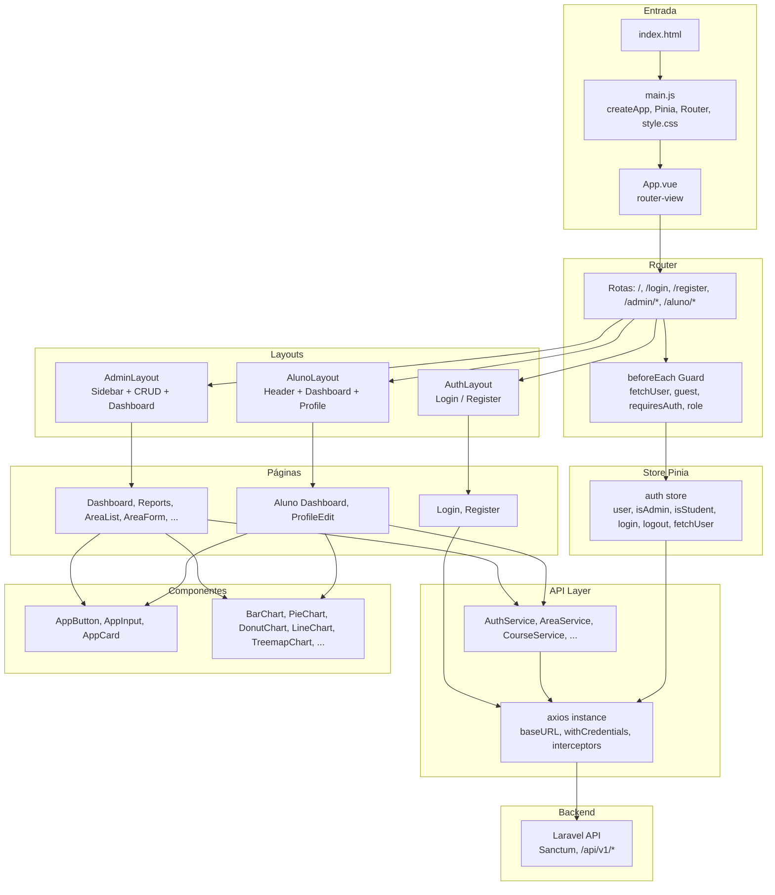

# **Plataforma Prof. Jubilut – Frontend (Vue 3 SPA)**

Bem-vindo ao **frontend** da Plataforma Prof. Jubilut: uma **SPA (Single Page Application)** em **Vue 3** que consome a API REST do backend Laravel. O frontend oferece duas áreas distintas — **Administração** e **Aluno** — com rotas protegidas por papel (`admin` e `student`), autenticação via **Laravel Sanctum** (sessão/cookies), dashboards com gráficos (**ApexCharts**), CRUD completo para áreas, cursos, professores, disciplinas, alunos e matrículas (admin), relatórios com tabela e gráficos, e perfil do aluno (edição de nome, e-mail e data de nascimento). A interface é responsiva (**Tailwind CSS**) e preparada para uso em dispositivos móveis.

O frontend é o **único** cliente de interface da aplicação: não há UI no backend além da página inicial e da documentação; todo o fluxo de login, cadastro, dashboards e CRUDs é feito nesta SPA, com o **Vite** fazendo proxy das requisições para o backend durante o desenvolvimento.

## 📋 Índice

- [Visão Geral](#-visão-geral)
- [Arquitetura do Frontend](#-arquitetura-do-frontend)
- [Fluxo de Autenticação e Navegação](#-fluxo-de-autenticação-e-navegação)
- [Estrutura de Pastas e Componentes](#-estrutura-de-pastas-e-componentes)
- [API Client e Tratamento de Erros](#-api-client-e-tratamento-de-erros)
- [Store de Autenticação (Pinia)](#-store-de-autenticação-pinia)
- [Serviços (Camada de API)](#-serviços-camada-de-api)
- [Layouts e Rotas](#-layouts-e-rotas)
- [Componentes de UI e Gráficos](#-componentes-de-ui-e-gráficos)
- [Páginas por Área](#-páginas-por-área)
- [Tecnologias e Stack](#-tecnologias-e-stack)
- [Variáveis de Ambiente e Proxy](#-variáveis-de-ambiente-e-proxy)
- [Execução e Build](#-execução-e-build)

---

## 🚀 Visão Geral

O frontend da Plataforma Prof. Jubilut oferece:

1. **🔐 Autenticação e Redirecionamento por Papel:** Tela única de login (`/login`); após o login, o usuário é redirecionado para `/admin/dashboard` ou `/aluno/dashboard` conforme `user.role` retornado pelo backend. O **router guard** (`beforeEach`) garante: usuário não autenticado em rota que exige auth → redireciona para `/login`; usuário autenticado em rota `guest` → redireciona para o dashboard do seu papel; acesso a rota de outro papel (ex.: admin em `/aluno/*`) → redireciona para o dashboard correto. O store **auth** (Pinia) expõe `isAdmin`, `isStudent`, `userName` e centraliza `fetchUser`, `login`, `logout`.

2. **📊 Dashboard Admin:** Página com resumo em cards (alunos, matrículas, cursos, professores, áreas, disciplinas) e grid de gráficos: alunos por curso, idade média por curso, alunos por faixa etária (donut), matrículas por curso (pie), alunos por área (treemap), matrículas nos últimos 6 meses (line), novos alunos por mês (line), disciplinas por curso – top 10 (bar). Dados vindos de `GET /api/v1/admin/dashboard` (chart_data). Visual em tema escuro com cards em “glass” e grid responsivo.

3. **📈 Relatórios Admin:** Página de relatórios com tabela (média de idade por curso, aluno mais novo e mais velho) e os mesmos dados de gráficos do dashboard, consumindo `GET /api/v1/admin/reports`.

4. **📋 CRUD Completo (Admin):** Listagens com tabela, ordenação (mais recentes, mais antigos, A–Z, Z–A) e, no caso de **Alunos**, busca por nome ou e-mail. Formulários de criação e edição para: Áreas, Cursos, Professores, Disciplinas, Alunos e Matrículas. Cada entidade tem seu **Service** (AreaService, CourseService, etc.) que chama os endpoints da API v1 admin.

5. **👤 Área do Aluno:** Dashboard com três blocos: **Meus cursos** (donut), **Minha idade** (número + barra), **Minhas matrículas** (pie). Página **Editar cadastro** (perfil) com formulário para nome, e-mail e data de nascimento, consumindo `GET/PUT /api/v1/aluno/profile`. O aluno só acessa suas próprias informações.

6. **🎨 Componentes Reutilizáveis:** Botões (AppButton), inputs (AppInput), cards (AppCard) e uma suíte de gráficos (BarChart, PieChart, DonutChart, LineChart, TreemapChart, RadarChart, RadialBarChart) baseados em **ApexCharts** (vue3-apexcharts), com suporte a tema escuro, labels truncados e layout responsivo.

7. **🛡️ Tratamento Global de Erros:** O cliente **Axios** (api/axios.js) possui interceptor de resposta: em 401/403 limpa armazenamento local e rejeita com mensagem; em 422 normaliza erros de validação em `error.validationErrors`. O guard do router não redireciona dentro do interceptor para evitar loops (ERR_TOO_MANY_REDIRECTS).

### 🎯 Diferenciais

- **SPA única:** Toda a experiência de uso (login, register, admin, aluno) em um único bundle; rotas com lazy-load de páginas (`import()`).
- **Consistência visual:** Tailwind + componentes UI padronizados; gráficos com mesma família de cores e comportamento responsivo.
- **Integração total com backend:** CSRF via `/sanctum/csrf-cookie`, login/register/logout e API v1 com `withCredentials: true` para cookies de sessão.
- **Mobile-first:** Layouts responsivos, sidebar recolhível no admin (overlay em mobile), tabelas com overflow horizontal quando necessário.

---

## 🏗️ Arquitetura do Frontend

O frontend é uma SPA Vue 3 com **Vue Router** (history mode), **Pinia** (store de auth) e **Axios** (instância configurada com baseURL, credentials e interceptors). As páginas são organizadas por contexto: **auth** (login, register), **admin** (dashboard, CRUDs, reports, register admin) e **aluno** (dashboard, profile). Cada área usa um **Layout** (AuthLayout, AdminLayout, AlunoLayout) que envolve o `<router-view />` e fornece cabeçalho, menu e área de conteúdo.

### Diagrama da Arquitetura



---

## 🔄 Fluxo de Autenticação e Navegação

1. **Primeira visita:** Ao acessar qualquer rota, o guard `beforeEach` chama `auth.fetchUser()` (se ainda não foi feito). Se o backend retornar 401, `user` fica `null`. Se a rota exige auth (`meta.requiresAuth`), o guard redireciona para `/login?redirect=...`.

2. **Login:** O usuário preenche e-mail e senha na página Login. O frontend chama `AuthService.getCsrfCookie()` e em seguida `AuthService.login(credentials)` (POST /login). O backend retorna `user` (com `role` e, se aluno, `student`). O store chama `setUser(user)` e o router redireciona para `/admin/dashboard` ou `/aluno/dashboard` conforme `user.role`.

3. **Rotas guest (login/register):** Se o usuário já estiver logado e acessar `/login` ou `/register`, o guard redireciona para o dashboard do seu papel.

4. **Rotas por papel:** Rotas em `/admin/*` têm `meta: { requiresAuth: true, role: 'admin' }`. Se o usuário logado tiver `role === 'student'`, o guard redireciona para `/aluno/dashboard`. O inverso vale para `/aluno/*` e `role: 'student'`.

5. **Logout:** O layout chama `authStore.logout()` (POST /logout) e em seguida `router.push('/login')`. O store zera `user` e `userFetched`.

---

## 📁 Estrutura de Pastas e Componentes

```
frontend/
├── index.html
├── package.json
├── vite.config.js
├── tailwind.config.js
├── postcss.config.js
├── src/
│   ├── main.js              # Bootstrap: createApp, Pinia, Router, style.css
│   ├── App.vue              # Raiz: <router-view />
│   ├── style.css            # Estilos globais + Tailwind
│   ├── api/
│   │   └── axios.js         # Instância Axios + interceptors (401, 403, 422)
│   ├── stores/
│   │   └── auth.js          # Pinia store: user, isAdmin, isStudent, fetchUser, login, logout
│   ├── router/
│   │   └── index.js         # Rotas + beforeEach guard (guest, requiresAuth, role)
│   ├── services/            # Camada de chamadas à API (um por domínio)
│   │   ├── AuthService.js
│   │   ├── AdminDashboardService.js
│   │   ├── AreaService.js, CourseService.js, TeacherService.js, DisciplineService.js
│   │   ├── StudentService.js, EnrollmentService.js
│   │   ├── ReportService.js
│   │   └── AlunoService.js
│   ├── utils/
│   │   ├── formatDate.js    # Formatação de data pt-BR
│   │   └── index.js         # Reexportações
│   ├── layouts/
│   │   ├── AuthLayout.vue   # Container para login/register
│   │   ├── AdminLayout.vue # Sidebar + header + menu admin
│   │   └── AlunoLayout.vue # Header com links Dashboard / Editar cadastro
│   ├── components/
│   │   ├── ui/
│   │   │   ├── AppButton.vue
│   │   │   ├── AppInput.vue
│   │   │   └── AppCard.vue
│   │   └── charts/
│   │       ├── BarChart.vue, PieChart.vue, DonutChart.vue
│   │       ├── LineChart.vue, TreemapChart.vue
│   │       ├── RadarChart.vue, RadialBarChart.vue
│   ├── pages/
│   │   ├── auth/
│   │   │   ├── Login.vue
│   │   │   └── Register.vue
│   │   ├── admin/
│   │   │   ├── Dashboard.vue
│   │   │   ├── Reports.vue
│   │   │   ├── RegisterAdmin.vue
│   │   │   ├── areas/       # AreaList.vue, AreaForm.vue
│   │   │   ├── courses/     # CourseList.vue, CourseForm.vue
│   │   │   ├── teachers/    # TeacherList.vue, TeacherForm.vue
│   │   │   ├── disciplines/ # DisciplineList.vue, DisciplineForm.vue
│   │   │   ├── students/    # StudentList.vue, StudentForm.vue
│   │   │   └── enrollments/ # EnrollmentList.vue, EnrollmentForm.vue
│   │   └── aluno/
│   │       ├── Dashboard.vue
│   │       └── ProfileEdit.vue
```

---

## 🌐 API Client e Tratamento de Erros

**Arquivo:** `src/api/axios.js`

- **Instância:** `axios.create()` com `baseURL: import.meta.env.VITE_API_URL || ''`, `withCredentials: true` e headers `Accept: application/json`, `Content-Type: application/json`, `X-Requested-With: XMLHttpRequest`.
- **Interceptor de resposta (erro):**
  - **401 / 403:** Remove `user` do localStorage e limpa sessionStorage; rejeita com `error.message` (mensagem do backend ou padrão "Não autenticado" / "Acesso não autorizado"). O router guard e as páginas tratam o redirecionamento para login; não se faz redirect no interceptor para evitar loop.
  - **422:** Se `data.errors` existir, atribui a `error.validationErrors` e `error.message`; os formulários usam isso para exibir erros por campo.
  - Outros erros: rejeita o erro original.

---

## 🗃️ Store de Autenticação (Pinia)

**Arquivo:** `src/stores/auth.js`

- **State:** `user` (objeto do usuário ou null), `loading`, `userFetched`.
- **Getters:** `isAuthenticated`, `isAdmin` (user?.role === 'admin'), `isStudent` (user?.role === 'student'), `userName` (user?.name ?? '').
- **Actions:**
  - **fetchUser():** GET `/api/v1/user`; atualiza `user` com o retorno (suporta formato `data` ou objeto direto); marca `userFetched = true`. Usado pelo router guard na primeira navegação.
  - **login(credentials):** Não é usado diretamente pelo Login.vue; a página chama AuthService e depois setUser. O store pode expor login se desejado.
  - **logout():** POST `/logout`, zera `user` e `userFetched`.
  - **setUser(user):** Normaliza e atribui a `user` (usado após login).
  - **init():** Se já tem user retorna; senão chama fetchUser.

---

## 📡 Serviços (Camada de API)

Cada serviço é um objeto com métodos que chamam a instância `api` (axios) e retornam a promise. Respostas são usadas nas páginas como `(await Service.method()).data`; a estrutura (data.data ou data) é tratada nas páginas conforme o formato do backend (API Resources).

| Serviço | Métodos | Endpoints |
|---------|---------|-----------|
| **AuthService** | getCsrfCookie, login, loginAluno, loginAdmin, register, registerAdmin, logout, getUser | /sanctum/csrf-cookie, /login, /login/aluno, /login/admin, /register, /api/v1/admin/register, /logout, /api/v1/user |
| **AdminDashboardService** | getChartData | GET /api/v1/admin/dashboard |
| **AreaService** | getAll, getOne, create, update, delete | GET/POST/GET/PUT/DELETE /api/v1/admin/areas |
| **CourseService** | getAll, getOne, create, update, delete | /api/v1/admin/courses |
| **TeacherService** | getAll, getOne, create, update, delete | /api/v1/admin/teachers |
| **DisciplineService** | getAll, getOne, create, update, delete | /api/v1/admin/disciplines |
| **StudentService** | getAll, getOne, create, update, delete | /api/v1/admin/students (getAll com params: search, sort, per_page) |
| **EnrollmentService** | getAll, getOne, create, getCreateData, update, delete | /api/v1/admin/enrollments, GET .../enrollments/create |
| **ReportService** | getCourseAges | GET /api/v1/admin/reports |
| **AlunoService** | getDashboardChart, getProfile, updateProfile | GET /api/v1/aluno/dashboard, GET/PUT /api/v1/aluno/profile |

---

## 📐 Layouts e Rotas

### Layouts

- **AuthLayout:** Container centralizado com título "Plataforma Prof. Jubilut", subtítulo "Entre ou cadastre-se", e `<router-view />` para Login ou Register. Rodapé com copyright.
- **AdminLayout:** Sidebar fixa (recolhível em mobile com overlay), links para Dashboard, Áreas, Cursos, Professores, Disciplinas, Alunos, Matrículas, Relatórios e Cadastrar administrador. Header com título da rota atual, nome do usuário e botão Sair. Conteúdo em `<main>` com `<router-view />`.
- **AlunoLayout:** Header com logo, links "Dashboard" e "Editar cadastro", nome do usuário e Sair. Conteúdo em `<main>` com `<router-view />`.

### Rotas (resumo)

| Path | Layout | Meta | Página |
|------|--------|------|--------|
| / | — | redirect por auth | /login ou /admin/dashboard ou /aluno/dashboard |
| /login | AuthLayout | guest | Login.vue |
| /register | AuthLayout | guest | Register.vue |
| /admin/dashboard | AdminLayout | requiresAuth, role admin | Dashboard.vue |
| /admin/areas | AdminLayout | requiresAuth, role admin | AreaList.vue |
| /admin/areas/create | AdminLayout | formMode create | AreaForm.vue |
| /admin/areas/:id/edit | AdminLayout | formMode edit | AreaForm.vue |
| /admin/courses, /courses/create, /courses/:id/edit | AdminLayout | idem | CourseList, CourseForm |
| /admin/teachers, ... | AdminLayout | idem | TeacherList, TeacherForm |
| /admin/disciplines, ... | AdminLayout | idem | DisciplineList, DisciplineForm |
| /admin/students, ... | AdminLayout | idem | StudentList, StudentForm |
| /admin/enrollments, ... | AdminLayout | idem | EnrollmentList, EnrollmentForm |
| /admin/reports | AdminLayout | requiresAuth, role admin | Reports.vue |
| /admin/register | AdminLayout | requiresAuth, role admin | RegisterAdmin.vue |
| /aluno/dashboard | AlunoLayout | requiresAuth, role student | aluno/Dashboard.vue |
| /aluno/profile | AlunoLayout | requiresAuth, role student | ProfileEdit.vue |

---

## 🧩 Componentes de UI e Gráficos

### UI

- **AppButton:** Botão com variantes `primary`, `secondary`, `danger`; props `type`, `disabled`; emite `click`. Classes Tailwind para tamanho, foco e estado desabilitado.
- **AppInput:** Input controlado com `v-model` (modelValue), props `label`, `type`, `placeholder`, `required`, `disabled`, `error`; emite `update:modelValue`. Exibe mensagem de erro abaixo do campo.
- **AppCard:** Container com borda, sombra e slot opcional `title`; usado para agrupar conteúdo (ex.: cards do dashboard aluno, blocos de relatório).

### Gráficos (ApexCharts via vue3-apexcharts)

Todos recebem dados no formato **labels** (array de strings) e **series** (array de números), exceto variações (ex.: LineChart com uma série temporal). Suportam tema **dark** (labels em cor clara) e são responsivos.

| Componente | Tipo ApexCharts | Uso típico | Props principais |
|------------|-----------------|------------|-------------------|
| **BarChart** | bar | Alunos por curso, idade média, disciplinas por curso, “minha idade” (1 barra) | labels, series, color, horizontal, dark, hideYAxis |
| **PieChart** | pie | Matrículas por curso (admin), minhas matrículas (aluno) | labels, series, colors, dark, compactLabels |
| **DonutChart** | donut | Alunos por faixa etária, meus cursos (aluno) | labels, series, colors, dark |
| **LineChart** | area (linha preenchida) | Matrículas por mês, novos alunos por mês | labels, series, color, dark, hideYAxis |
| **TreemapChart** | treemap | Alunos por área | labels, series, colors, dark |
| **RadarChart** | radar | Dados multidimensionais (se usado) | labels, series, color, dark |
| **RadialBarChart** | radialBar | Indicador único (se usado) | — |

Os gráficos do dashboard admin usam paletas (donutColors, pieColors, treemapColors) em tons de cyan, green, amber, red, violet, etc., para consistência visual.

---

## 📄 Páginas por Área

### Auth

- **Login.vue:** Formulário com e-mail, senha e “Lembrar de mim”. Chama CSRF cookie e AuthService.login; em sucesso atualiza auth store e redireciona (redirect query ou dashboard por role). Exibe mensagem se `?registered=1`. Link para cadastro como aluno; texto informando que administradores usam a mesma tela.
- **Register.vue:** Formulário de cadastro de aluno (nome, e-mail, senha, confirmação, data de nascimento). POST /register; em sucesso redireciona para /login?registered=1. Erros de validação exibidos por campo.

### Admin

- **Dashboard.vue:** Carrega dados via AdminDashboardService.getChartData(). Exibe cards de resumo (summary) e grid de gráficos (BarChart, DonutChart, PieChart, LineChart, TreemapChart) com títulos. Estilo “dashboard tech” com fundo escuro e cards em glass.
- **Reports.vue:** Carrega ReportService.getCourseAges(); exibe tabela do relatório (curso, média de idade, mais novo, mais velho) e os mesmos dados de gráficos (chart_data).
- **RegisterAdmin.vue:** Formulário para cadastrar novo administrador (nome, e-mail, senha); chama AuthService.registerAdmin (POST /api/v1/admin/register).
- **AreaList.vue:** Tabela de áreas com ordenação (select sort) e botão “Nova área”. Links Editar e botão Excluir (com confirm). AreaService.getAll({ sort, per_page }).
- **AreaForm.vue:** Formulário nome; modo create ou edit (route.params.id). AreaService.create/update; em sucesso redireciona para /admin/areas. Erros de validação em errors.name.
- **CourseList / CourseForm:** Padrão análogo para cursos (título, descrição, datas, área).
- **TeacherList / TeacherForm:** Professores (nome, e-mail).
- **DisciplineList / DisciplineForm:** Disciplinas (título, descrição, curso, professor).
- **StudentList.vue:** Inclui campo de busca (v-model search) e ordenação; StudentService.getAll({ search, sort, per_page }). Tabela com nome, e-mail e ações.
- **StudentForm.vue:** Formulário para aluno (nome, e-mail, data de nascimento).
- **EnrollmentList.vue / EnrollmentForm.vue:** Listagem de matrículas; formulário com seleção de aluno e curso (dados de create via GET .../enrollments/create).

### Aluno

- **Dashboard.vue:** AlunoService.getDashboardChart(); exibe três AppCards: Meus cursos (DonutChart), Minha idade (valor + BarChart com uma barra), Minhas matrículas (PieChart).
- **ProfileEdit.vue:** Carrega perfil com AlunoService.getProfile(); formulário nome, e-mail, data de nascimento; submit chama updateProfile e atualiza exibição. Apenas o próprio aluno altera seus dados (garantido pelo backend).

---

## 🛠️ Tecnologias e Stack

- **Vue** ^3.4
- **Vue Router** ^4.2 (history mode)
- **Pinia** ^2.1 (store auth)
- **Axios** ^1.6 (cliente HTTP)
- **Vite** ^5.0 (build e dev server)
- **@vitejs/plugin-vue** ^5.0
- **Tailwind CSS** ^3.4 + PostCSS + Autoprefixer
- **ApexCharts** ^4.0 + **vue3-apexcharts** ^1.4 (gráficos)
- **lucide-vue-next** ^0.460 (ícones no AdminLayout)

---

## 🔧 Variáveis de Ambiente e Proxy

- **VITE_API_URL:** Base URL da API (vazio em dev quando se usa proxy). Em produção pode ser definido (ex.: `https://api.exemplo.com`).
- **Proxy (vite.config.js):** Em desenvolvimento, as requisições para `/api`, `/sanctum`, `/login`, `/register`, `/logout` são encaminhadas para `http://127.0.0.1:8000` (backend Laravel). Assim, a SPA em `http://localhost:5173` envia cookies para o mesmo “origin” (proxy), evitando problemas de CORS com sessão Sanctum.

---

## ▶️ Execução e Build

**Desenvolvimento:**

```bash
cd frontend
npm install
npm run dev
```

Acesse **http://localhost:5173**. Certifique-se de que o backend está rodando (ex.: `php artisan serve` na porta 8000) para o proxy funcionar.

**Build para produção:**

```bash
npm run build
```

A saída fica em `frontend/dist/`. Em produção, esses arquivos podem ser servidos pelo Laravel (pasta `public`), por Nginx ou outro servidor, com proxy da API para o backend. A variável `VITE_API_URL` deve apontar para a URL base da API em produção, se a SPA não estiver no mesmo host.

**Preview do build:**

```bash
npm run preview
```

---

**Resumo:** O frontend é a SPA Vue 3 da Plataforma Prof. Jubilut: autenticação por papel, dashboards com gráficos (admin e aluno), CRUD completo para o admin, relatórios, perfil do aluno, componentes de UI e gráficos reutilizáveis, integração com o backend via Axios e Sanctum, e rotas protegidas por guard e meta (role). Toda a experiência do usuário (admin e aluno) é entregue por este projeto.
